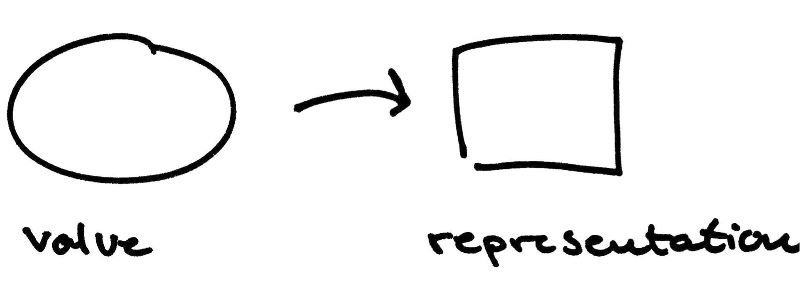
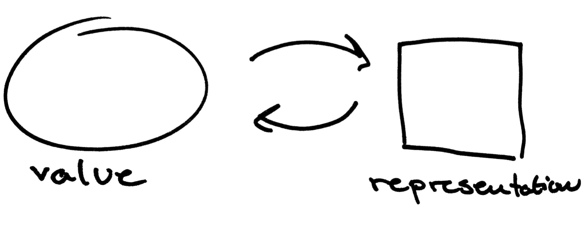
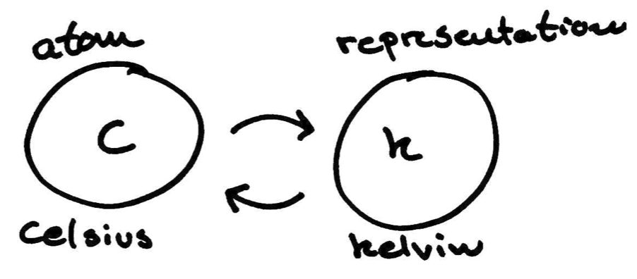
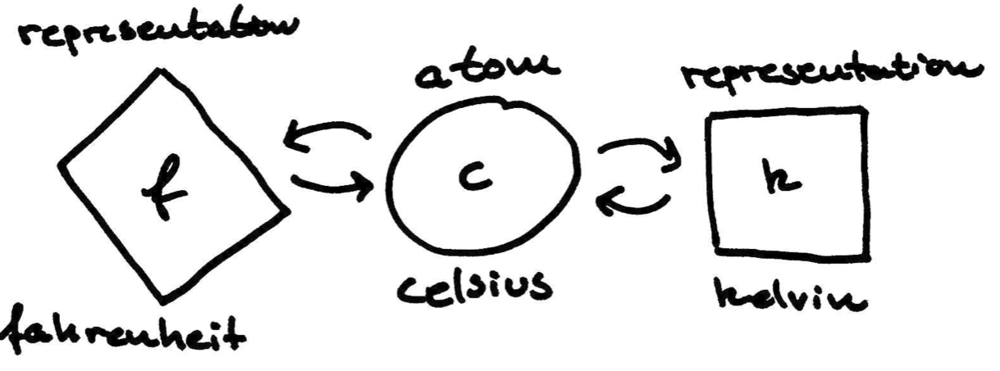
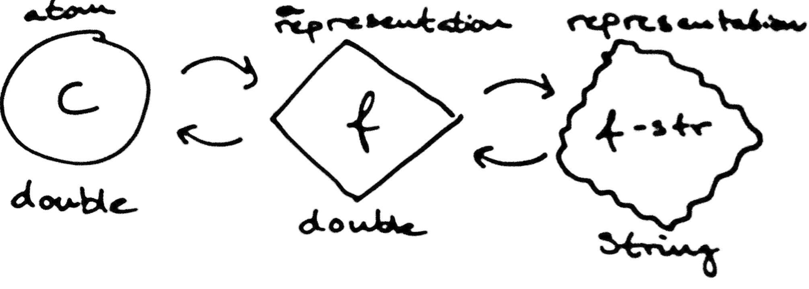

Mapped references
=================

The idea behind mapped references is to keep several representations of the same value in a system.
For example, the date 24th of December, 2012 can be expressed as the string "2012-12-24", as a Joda DateTime object or as the long 1234567890.
In this implementation of the concept, values are modelled as atoms and representations are a new type implement the IRef protocol.

Examples
--------

A representations does not have to model the entire state of the original value.
For example, it could model a subset of tables from a database of a subtree.

A representation is defined by a function mapping a value of the original type to the representation type.

For a representation to be a proper reference, there should also exist a mapping going the other way, from mapped reference to the original type.

A fun example is temperature.
If a temperature in our system is modelled as number of degrees celcius in the atom `c`, a derived representation could be the temperature in kelvin.
Mapping form celcius to kelvin and back is easy: just add 273.15 to go from celcius to kelvin, and subtract 273.15 to go the other way.

    (defn c->k [celcius] (+ celcius 273.15))
    (defn k->c [kelvin] (- kelvin 273.15))

To create a mapped reference, the function `mapping` from the library can be used.
`mapping` takes a representation function and a reference updating function.
The representation function has one argument, the original value, whereas the reference updating function also takes the new value in the represented form.
In this example, a helper function `bijective-mapping` is used for easily creating representations that do not need the original value.

    (defn bijective-mapping
      [f f-inv]
      (mapping
        (fn [x] (f x))
        (fn [old y] (f-inv y)))) ;; 'old' is ignored as it is not needed for bijective mappings

    (def c->k-mapping (bijective-mapping c->k k->c))

    (def c (atom 0))
    (def k (c->k-mapping c))

    @c ;; -> 0
    @k ;; -> -273.15
    
    (swap! inc c)
    @k ;; -> -272.15

To avoid misunderstandings, the function `swap!` is reserved for atoms.
To alter a mapped reference, the function `rep-swap!` is used.

    (rep-swap! inc k) ; -> 271.15
    @c ; -> 2

Of course, more representations can be added to the same base variable, as in this example where the affine mapping between celcius and fahrenheit is used.
This time, a helper function for creating representations of affine mappings is used.

    (defn affine-mapping
      [a b]
       (bijective-mapping
        #(+ (* % a) b)
        #(/ (- % b) a)))  

    (def c->f-mapping (affine-mapping 9/5 32))

    (def f (c->f-mapping c))

    @f ;; -> ...

    (rep-swap! f inc) ;; -> ...
    
    @c ;; -> ...
    @k ;; -> ...

A representation can of course have another representation built on top of it

    (def float->str
         (bijective-mapping (comp str float) #(Float/parseFloat %)))

    (def f-str (-> c c->f float->str))
    @f-str ;;-> 33.8
    
    (rep-swap! f-str (constantly "32")) ;; -> "32.0"
    @c ;;-> 0.0

Some representations do need the original value when being updated.
In this example, the value for a key in a map is being used as a reference directly into a map.

    (defn sub-mapping [key]
      (mapping
       (fn [val] (get val key))
       (fn [ref-map new-val] (assoc ref-map key new-val))))

    (def select-x (sub-mapping :x))

    (def m (atom {:x 10 :y 4})
    (def x (select-x m))

    @x ;; -> 10

    (rep-swap! x dec)
    @m ;; -> {:x 9 :y 4}

References can be combined to create advanced representations of a value in the system

    (def temp-map (atom {:zurich "32.0"}))
    (def zurich-as-fahrenheit (-> temp-map select-x str->float c->f))
    @zurich-as-fahrenheit ;; -> ...
    
